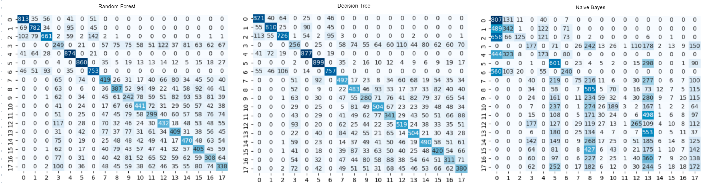
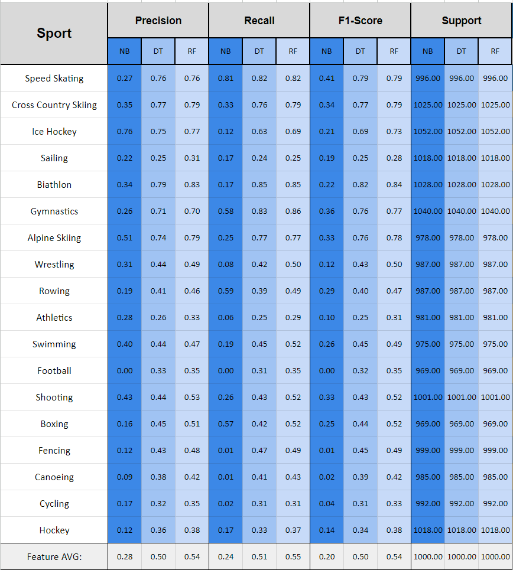

# The Athlete In You: Increasing Engagement For The Olympic Games

## Introduction

The Olympics is one of those sports shows that has grown in viewership in recent years. Moreover, this newfound growth needs constant work to continue to improve. To that end, an effective way to keep and increase viewership is through increasing engagement. A website that can tell one’s ability to play in any of the Olympic sports can increase engagement by up to 52.6% (Barreto).
 
**Concepts applied:**
- Classification Modeling: Naive Bayes, Decision Trees, Random Forest
- Model Deployment: Heroku, Flask, HTML

----
## Problem Statement
- How to increase the Olympic’s engagement?
- How can Olympic viewers be more invested in the sport?
- How to bring more awareness to the different sports and teams?
 
 ---- 
## Data Collection and Cleaning
- Data Collection
    - The dataset used for this project was originally created and posted on Kaggle by Randi Griffin. The dataset is a compilation of 120 years of Olympic history. It contains 15 features and 271116 rows. Some of the features include weight, height, age, sport, placement, and so on. The file of this dataset can be found at: https://www.kaggle.com/datasets/heesoo37/120-years-of-olympic-history-athletes-and-results
- Include the image of the dataset
- Data Cleaning
    - Data points are evaluated for correctness, datatypes, and overall
    - uniformity
    - Outliers are dropped from the dataset
    - Null values are imputed and dropped when needed

----
## Data Modeling:
- Pre-Modeling
    - The Sport class is selected as the target class
    - Sport class is balanced for 18 categories with 4000 observations each
    - Non-numeric datatypes are converted to numeric (float)
    - Correlation among the features is evaluated
    - Data is split into 75% and 25% for training and testing, respectively
- Modeling
    - A Naive Bayes, Decision Tree, and Random Forest algorithms are created
    - Models Evaluation
        - Confusion Matrix
            
        - Other Performance Metrics
            
- Model Results
    - Random forest is the best algorithm out of the three. This is gleaned from the confusion matrix comparison and its precision, sensitivity, and F1-score results. In the confusion matrix comparison, random forest shows better classification performance compared to decision trees and random forest. This is shown in its uniform diagonal line where most of the observations fall in their right category. This is not the case for algorithms like naive Bayes where most of the observations are scattered outside of this diagonal line, showing lack of overall correctness. This is also observed in naive Bayes’ precision, sensitivity, and F1-score results where it shows the lowest score by a significant margin when compared to the random forest and decision tree. Speaking of decision trees, this algorithm performs similarly to random forest in most measures. It only shows a small drop in performance across the board when compared to random forest.
- Model Deployment
    - HTML Index file is created with a form and graphics UI
    - The ML model is saved as a pickle file
    - ProcFile for Heroku is created and setup
    - Heroku is set to show HTML index and embed ML Model

----    
## Conclusion and Recommendations 
- Small to medium ML models are critical for effective deployment on the web
- The Decision Tree Algorithm is the best algorithm to deploy on the web. This is because it performs very similar to the best algorithms created on this project while being a fraction of the size
- Two components make for an ideal web model, reliability and size. These two are embodied by the decision tree, making it the best option for web deployment
- An ML model that can predict which type of sport your body is suited for is an effective way to increase engagement up to 52.6% (Barreto) 

